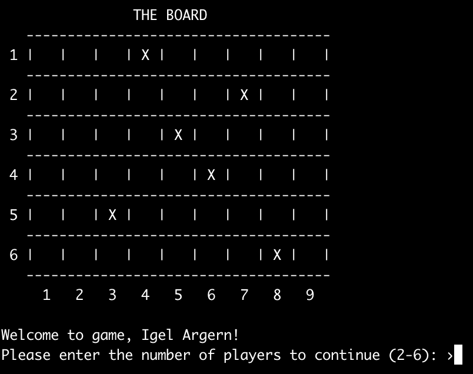

# Igel Ärgern 
#### UCD COMP10050 Software Engineering Project 1, Assignment 2
C implementation of the German board game, *Igel Ärgern* ("Hedgehogs in a Hurry").  

## Getting Started
### Windows
1. Download and run the executable file [here](./bin/igelArgern.exe), or
2. Use the Makefile to compile and run the game as follows (instructions for MINGW):  
* Enable the ```make``` command:  
```$ mingw-get install msys-make```    
* Compile the program by calling:    
```$ MINGW32-make```  
* Run the program by calling:    
```$ main```  

### MacOS/Linux
* Compile the program by calling:  
```$ make ```  
* Run the program by calling:  
```$ ./main```

## About The Game
  

* The standard game is played by 2-6 players on a board with 6 rows and 9 columns.   
* Each player has four tokens (representing hedgehogs) that he or she must move from   
the left column to the right column.   
* Tokens sharing a square are stacked on top of each other. 
* Only the token on the top of a stack may move.

On their turn, a player:
1. rolls the dice,
2. optionally moves one of their tokens up or down one row (we call this a *sideways*   
move, because the token is moved sideways relative to the direction of travel toward   
the finish line), and
3. chooses one token (either their own or another player's) in the row indicated by   
the dice roll and moves it one space to the right (i.e., "forward").

A token that falls into an *obstacle square* is stuck there until every other token has   
caught up (i.e. no token is placed in a column on the left of the obstacle in any row). 

* The *winner* is the player who can move three of their tokens to the last column of the board.  
Detailed rules: [boardgamegeek.com](https://boardgamegeek.com/boardgame/95/igel-argern)

## Authors
* [Jason Tee](https://github.com/AmplifiedHuman)
* [Rajit Banerjee](https://github.com/rajitbanerjee)

Grade received: A+
